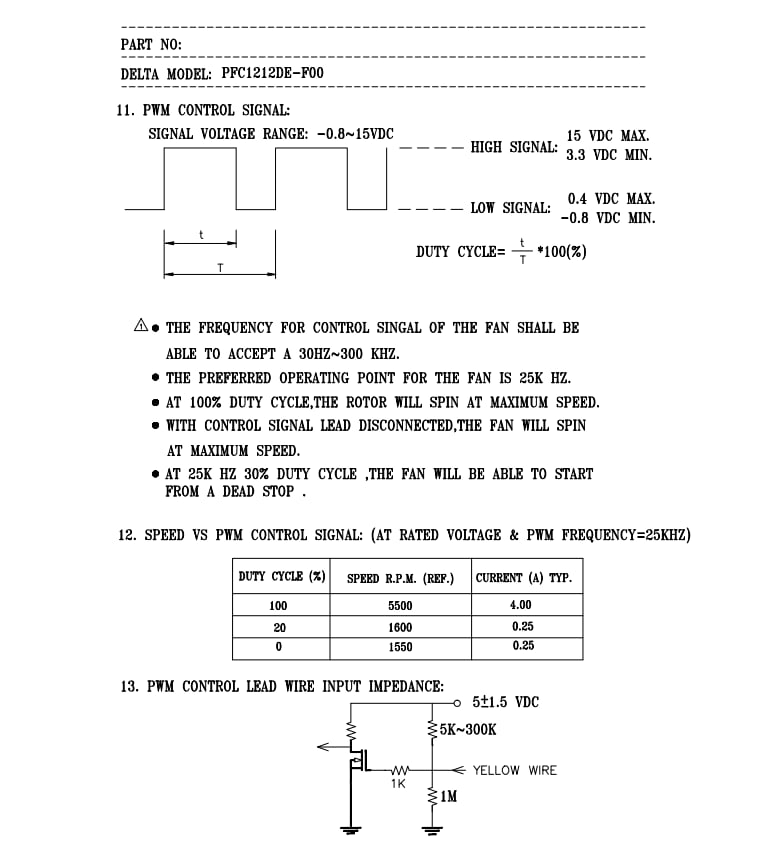
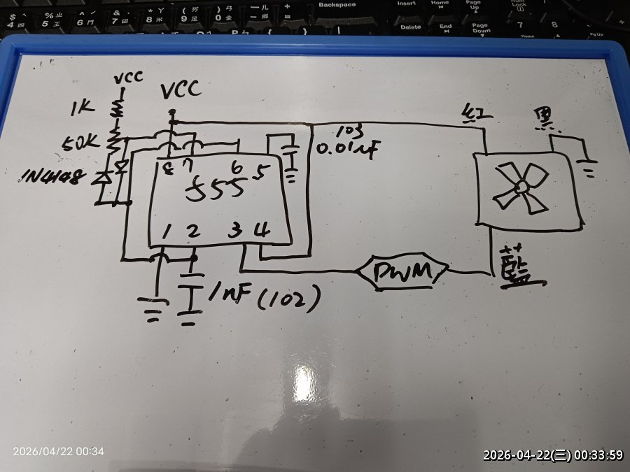
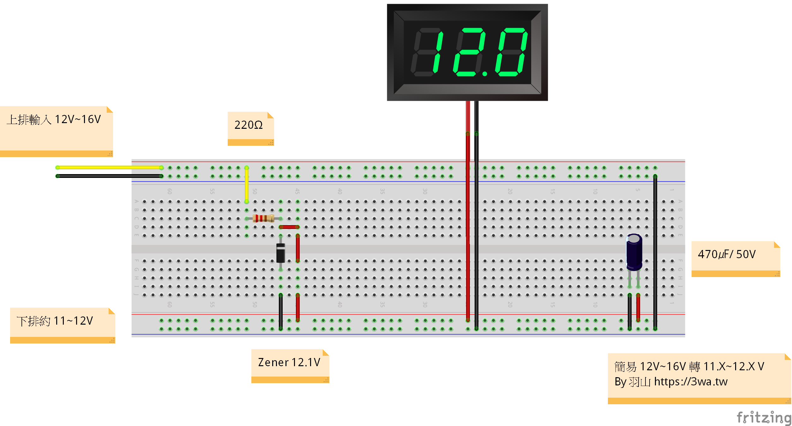
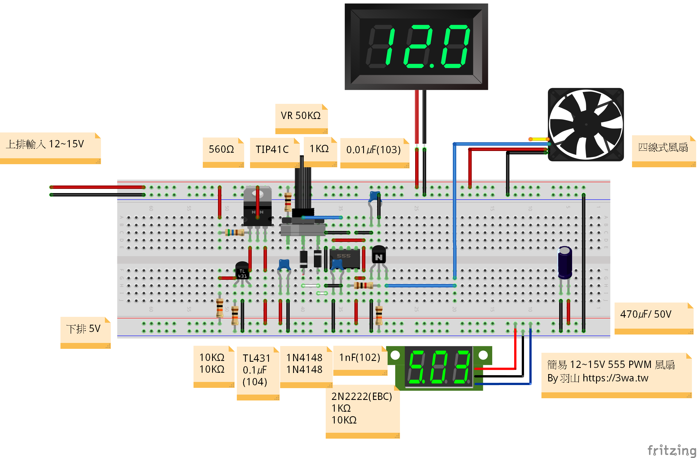
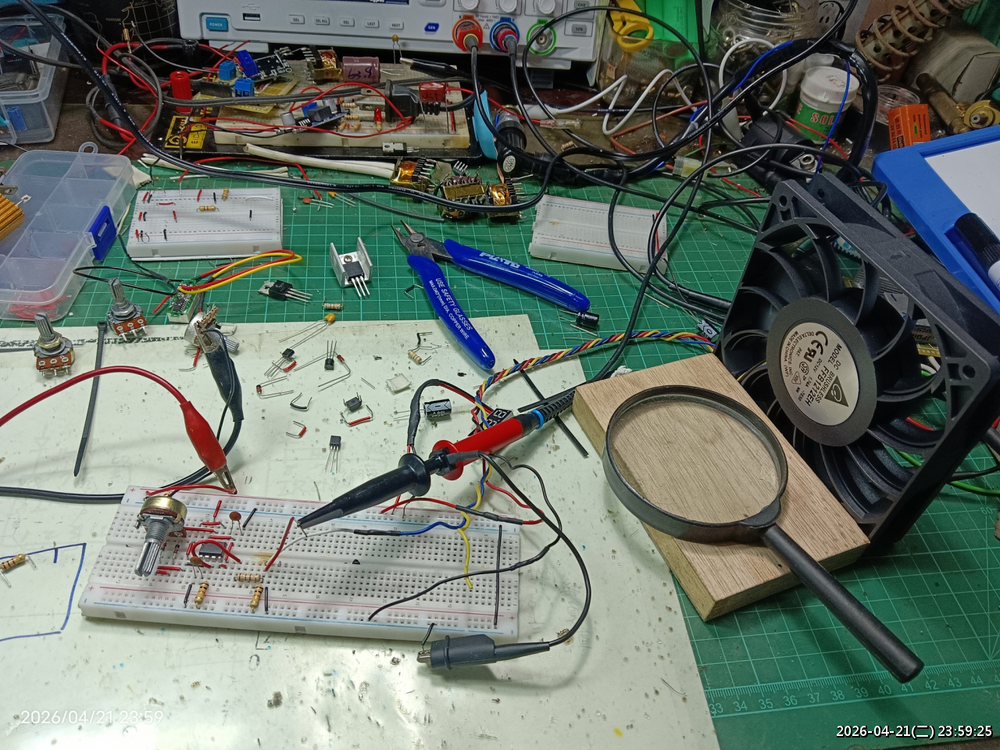
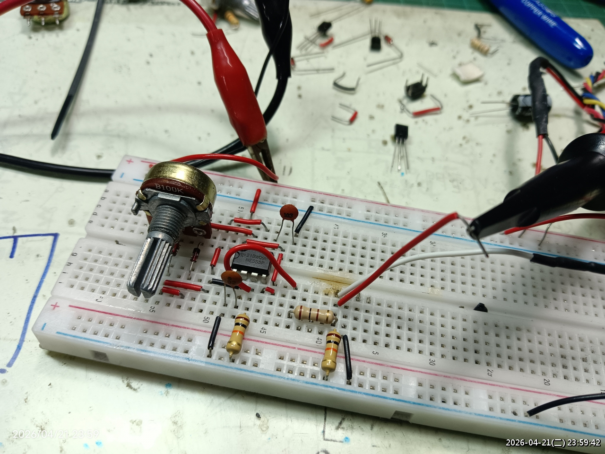

# 115_555FanPWM

用 `12V~15V` 輸入，先透過 `TL431 + TIP41C` 做出 `5V`，再以 `NE555` 產生約 `25kHz` PWM 訊號，提供給四線式風扇的 PWM 控制腳。

這個專案是偏向實驗與手作驗證的電路紀錄，重點是用常見零件完成一個不依賴 MCU 的四線風扇調速方案，並保留麵包板實作、手繪草圖與 Fritzing 檔，方便後續重做或再修改。像是機車也可以利用這類電路調整水冷排風扇風速，幫助散熱控制。

---

## 專案重點

- `12V~15V` 輸入，板上額外產生 `5V` 給 `555` 電路使用
- 另附簡易 `Zener 12.1V` 方案，可把 `12V~16V` 壓到約 `11V~12V`，作為 `555` 的另一種供電方式，不能直接供應風扇
- 使用 `NE555` 產生四線式風扇可接受的 PWM 控制訊號
- 以可變電阻調整占空比，改變風扇轉速
- 保留 Fritzing 麵包板圖、實拍照片與手繪原理草圖
- 目標是簡單、可重現、容易在工作台上快速搭起來

---

## 電路架構

整體分成兩塊：

1. `12V~15V -> 5V` 降壓電路
2. `NE555` PWM 產生器

另外也補了一個可供 `555` 使用的簡易供電方案：

3. `12V~16V -> 約 12V` Zener 限壓電路

四線式風扇的供電仍走 `12V`，控制端則吃 `555` 產生的 PWM 訊號。  
此做法適合拿來做基礎調速、測試風扇反應，或作為後續正式電路的前期驗證。

---

## 風扇控制說明

四線式風扇一般包含以下接線：

- `紅`：風扇電源正極
- `黑`：GND
- `黃`：轉速回授 (本電路沒用到)
- `藍`：PWM 控制

本專案主要使用：

- `紅 / 黑` 供應風扇電源 正/負
- `藍` 接 `555` 的 PWM 輸出

附圖中的規格截圖可看到，該風扇控制訊號偏好約 `25kHz`，因此本電路以這個頻率附近為目標。

---

## 主要元件

以下元件以目前圖面與實作照片為主：

- `NE555`
- `TL431`
- `TIP41C`
- `Zener 12.1V`
- `220R`
- `VR 50K`
- `100Ω`
- `560Ω`
- `1KΩ x 2`
- `10KΩ x 3`
- `1N4148 x 2`
- `電晶體 NPN 2N2222 (EBC)`
- `陶瓷電容 0.01uF (103)`
- `陶瓷電容 1nF (102)`
- `陶瓷電容 0.1uF (104)`
- `電解電容 470uF / 50V`
- 四線式 `12V` PWM 風扇 如: PFC1212DE (2.98A)、FFB1212EH (1.7A)
- 直流輸入電源 `12V~20V`

如果您要照著重做，仍建議先以手邊風扇的 datasheet 再確認一次 PWM 腳位需求與建議頻率。

---

## 檔案內容

- `README.md`
  - 專案說明與圖片索引
- `電路圖/circuit7~20Vto5V.fzz`
  - `TL431 + TIP41C` 的降壓 Fritzing 檔
- `電路圖/circuit12~16Vto12V.fzz`
  - 簡易 `Zener 12.1V` 限壓電路 Fritzing 檔
- `電路圖/circuit_PWM.fzz`
  - `555` 風扇 PWM 控制電路 Fritzing 檔
- `screenshot/circuit_PWM.png`
  - 完整麵包板配置圖
- `screenshot/circuit12~16Vto12V.png`
  - `12V~16V -> 約 12V` 簡易限壓電路圖
- `screenshot/circuit12to5.png`
  - `12V~15V -> 5V` 降壓電路麵包板圖
- `screenshot/hand_circuit.png`
  - 手繪原理草圖
- `screenshot/circuit_1.jpg`
  - 實作工作台照片
- `screenshot/circuit_2.jpg`
  - PWM 麵包板近拍
- `screenshot/25k_spec.png`
  - 風扇 PWM 規格截圖

---

## 圖片

### 1. 手繪草圖

先用手繪方式確認 `555` 腳位與 PWM 接法：

### 2. `12V~15V -> 5V` 降壓電路圖

獨立整理出供應 `555` 使用的 `5V` 降壓部分：

### 3. `12V~16V -> 約 12V` 簡易限壓電路圖

如果輸入略高於 `12V`，也可以先用簡單的 `Zener 12.1V + 220R + 470uF` 做供電前級，把輸出控制在約 `11V~12V` 區間，作為 `555` 的另一種電源方案；這一路只適合供應 `555`，不能直接拿來供應風扇：

### 4. Fritzing 麵包板圖

完整配置包含降壓、電壓顯示與風扇 PWM 控制：

### 5. 實作照片

實際在工作台上的測試狀態：

PWM 區域近拍：

---

## 工作原理簡述

### `12V~15V -> 5V`

使用 `TL431` 作為參考，搭配 `TIP41C` 組出簡單的線性降壓，提供 `555` 電路穩定的 `5V` 工作電壓。

### `12V~16V -> 約 12V`

這個版本使用 `12.1V Zener` 做簡易限壓，搭配 `220R` 與 `470uF` 電容，適合把稍高的輸入電壓先壓到接近 `12V` 的區間，作為 `555` 的另一種供電方式；這一路輸出僅供控制電路使用，不適合直接供應風扇負載。如果應用在機車上，可用它提供 `555` 控制端電源，再由原本的風扇供電路徑搭配 PWM 做水冷排風扇調速。

### `555 PWM`

`NE555` 依照 RC 與二極體配置產生 PWM 訊號，再透過可變電阻調整充放電比例，改變輸出占空比，最後把 PWM 送到四線式風扇的控制端。

這個方案的重點不是高效率，而是：

- 零件容易取得
- 不需要 MCU 或燒錄環境
- 適合快速驗證四線風扇 PWM 控制

---

## 使用方式

1. 準備 `12V~15V` 直流輸入
2. 依照 Fritzing 圖或手繪圖完成接線
3. 確認 `555` 端工作電壓約為 `5V`
4. 將四線風扇的 `PWM` 線接到控制輸出
5. 旋轉 `VR`，觀察風扇轉速與電壓表變化

---

## 注意事項

- 四線式風扇的 PWM 規格可能因品牌或型號不同而有差異
- 本電路是實驗用途，正式使用前建議自行量測頻率與占空比
- `Zener` 方案屬於簡易限壓，不適合高精度或大電流穩壓需求
- `Zener 12.1V` 這一路只能供 `555` 之類的控制電路使用，不能直接拿來供應風扇
- `TIP41C` 屬線性降壓用法，若壓差較大或負載較重，可能需要留意發熱
- 若要長時間運作，建議補上散熱、保護與更穩定的電源設計
- 接線前請再次確認風扇腳位定義，避免把 PWM 腳與回授腳接反

---

## 作者

羽山  
https://3wa.tw

---

## License

MIT License
